# Maintenance Wizard — User Journeys & Demo Script

> Four plant roles, six journeys. Part 1 is **real today** — every step is a click
> you can perform in the running app (deterministic mode, no API key needed), and
> each journey carries a timed demo script. Part 2 is **ROADMAP** — to-be journeys
> that drive our feature planning; nothing in Part 2 is built.

**How to read the tags:** plain step = runs today · 🔜 = approved tranche in
flight (`docs/superpowers/plans/2026-06-12-cascade-scenario-kpi.md`) · ROADMAP =
Part 2 only, not built.

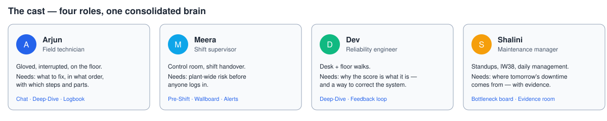

| Persona | Surface | Lives in |
|---|---|---|
| **Arjun — Field technician** | Rugged tablet on the floor | Wizard Chat, Deep-Dive, Logbook |
| **Meera — Shift supervisor** | Control-room wallboard + laptop | Pre-Shift Report, wallboard, alerts |
| **Dev — Reliability engineer** | Laptop, desk + floor walks | Deep-Dive, Logbook feedback |
| **Shalini — Maintenance manager** | Laptop, morning standup | Bottleneck board, evidence room |

---

# Part 1 — Today (demo-grade)

## T1 · Arjun, field technician — "The part that can't arrive in time"

> *At shift start the mill drive gearbox is trending toward failure — and the replacement pinion is 45 days away.*

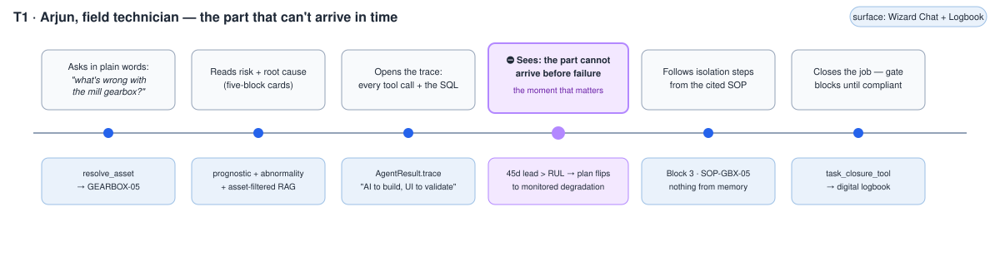

### The journey

1. **Arjun types what he'd say to a colleague** — *Wizard Chat*: "what's wrong
   with the mill gearbox?" `resolve_asset` maps the jargon to **GEARBOX-05**.
2. **The answer arrives as five fixed blocks** — risk (**CRITICAL**, 82.0/100,
   RUL **36.1 days**, failure probability 32%), root cause (top driver
   **vibration**, matched against historical incident records), blueprint,
   logistics, audit trail. Same contract every time, both engine modes.

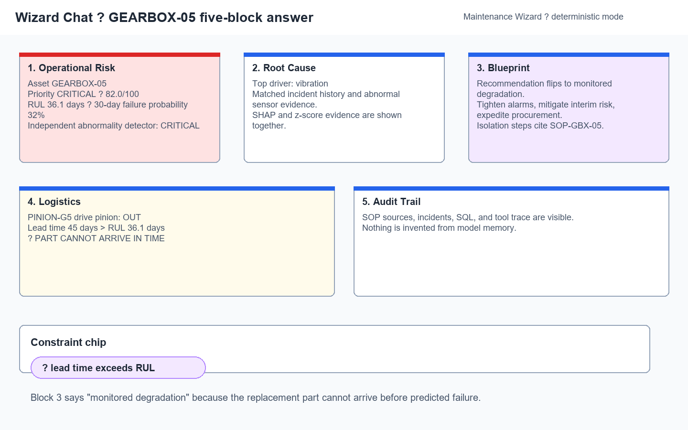

3. **He opens "how I got this"** — the trace expander lists all 8 tool
   calls with inputs and outputs, including the exact SQL:
   `SELECT delay_code, COUNT(*) AS n, SUM(downtime_min) AS mins FROM delays WHERE asset_id='GEARBOX-05' GROUP BY delay_code ORDER BY mins DESC`.

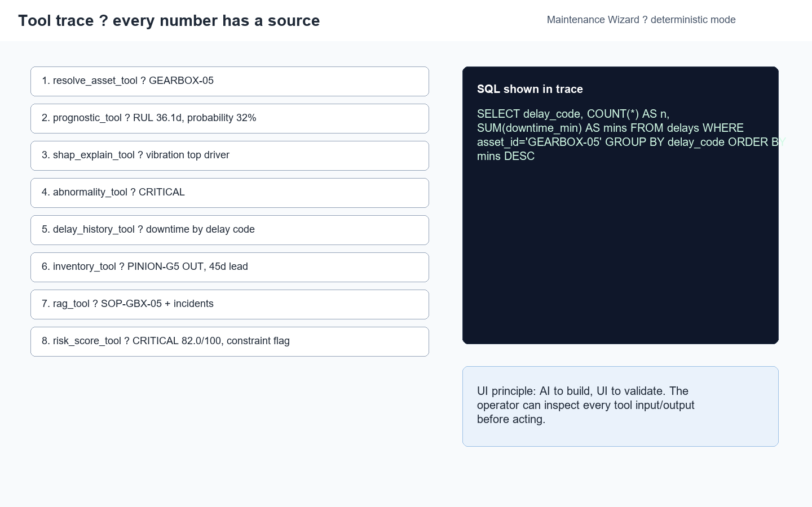

4. **⛔ The flip** — Block 4 shows the drive pinion `PINION-G5` is **out of
   stock with a 45-day lead** — longer than the 36.1-day RUL. The Wizard
   doesn't say "replace now" anyway; the recommendation flips to **monitored
   degradation**: tightened alarms, interim mitigation, expedited procurement.
5. **He works the isolation steps** — Block 3 lists them from **SOP-GBX-05**,
   cited by name. Torque values and steps come only from tool outputs — never
   from model memory.
6. **He closes the work order** — *Digital Logbook*: the closure button stays
   disabled until the 5/5 compliance checklist (parts recorded, steps logged,
   isolation cleared, follow-up scheduled, logbook entry) is green.

### What to notice (judges)

- **Step 2:** the five-block contract is identical in LLM and offline
  deterministic mode — run this demo with no API key.
- **Step 3:** observability as UX — every number traces to a tool output.
- **Step 4:** constraint-aware reasoning, not lookup: lead time vs RUL changes
  the *recommendation class*.
- **Step 6:** chat never writes; closure goes through a gated form. Side
  effects are opt-in by design.

### Demo script (2:30)

| Clock | Action | Expect on screen |
|---|---|---|
| 0:00 | Open the app; point at the engine-mode badge | "Deterministic (offline)" or "LLM" |
| 0:10 | Chat tab → type *what's wrong with the mill gearbox?* | Five block-cards render |
| 0:30 | Read Blocks 1-2 aloud | CRITICAL · 82.0/100 · RUL 36.1d · 32% failure probability; top driver vibration |
| 0:50 | Expand the tool trace | 8 calls; SQL in a code block |
| 1:10 | Point at Block 4 part rows | PINION-G5 OUT, 45d lead |
| 1:25 | Read the flip line in Block 3 | "monitored degradation" |
| 1:45 | Logbook tab → tick checklist items one by one | Button enables only at 5/5 |
| 2:15 | Close & log | Logbook entry appears |

### Traceability

Demonstrates PDF objectives: 4.3 (manuals/spares), 4.4 (NL queries), 5.1 (diagnosis, root cause, RUL), 5.2 (constraint-based priority), 5.3 (step-by-step actions, procurement strategy), 5.4 (digital log), 6.4 (explainability).

## T2 · Meera, shift supervisor — "The shift that starts itself"

> *It's 05:45. No one has logged in — but the plant has already been scanned,
> scored, and the night's new risk routed to the right inboxes.*

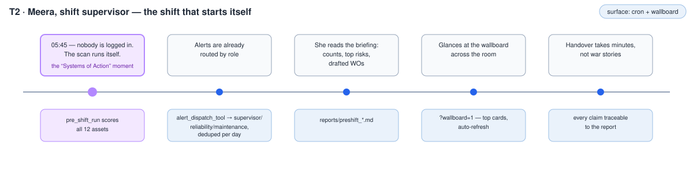

### The journey

1. **The scan runs itself** — *cron, before dawn*: `pre_shift_run` scores all
   12 assets with the same deterministic tools the chat uses and writes the
   shift briefing to `reports/`. This morning: **9 assets need
   attention** (1 critical).
2. **Alerts are already routed** — the critical overnight risk routes to
   `shift-supervisor@plant.local`, via `config.py` `ALERT_ROLES` (critical →
   supervisor, high → reliability, else maintenance). Re-running the scan does
   not re-spam: the repeated alert is **already sent today — deduped** for the
   same asset+band+day.
3. **Meera reads the briefing** — counts by band, urgent assets in score
   order, and a drafted work order for each — including long-lead parts to
   order now.

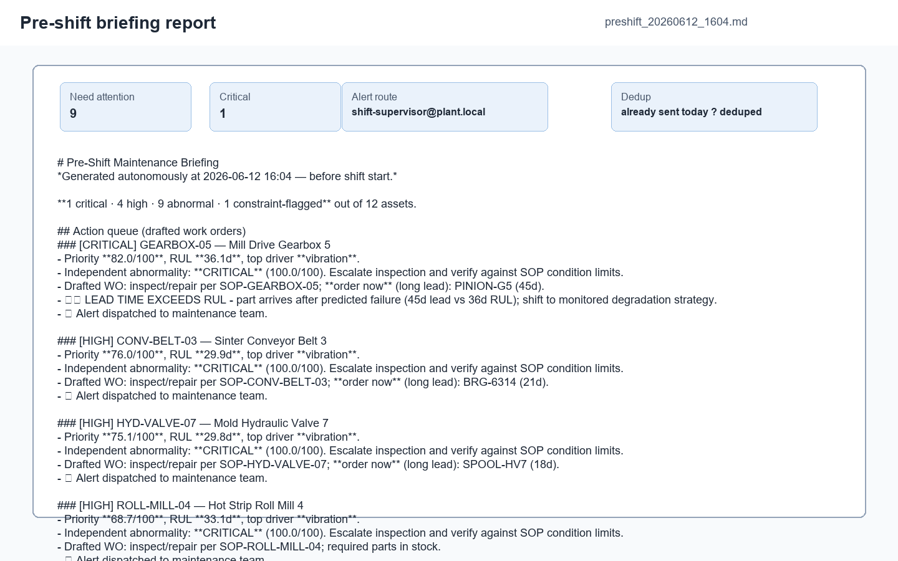

4. **She glances across the control room** — the wallboard
   (`?wallboard=1`) shows the top risk cards in wallboard mode, auto-refreshing.
   Severity is readable from meters away: color + icon + label, never color alone.

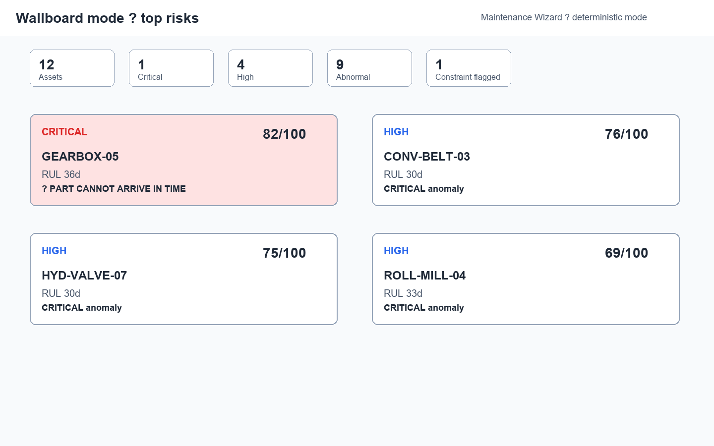

5. **Handover takes minutes, not war stories** — every claim in the meeting
   traces to the report file; yesterday-vs-today score deltas replace anecdotes.

### What to notice (judges)

- **Cron-friendly autonomy:** the same consolidated brain runs *proactively* —
  "Systems of Action": work product exists before the first human login.
- **Role routing:** alert destinations come from `config.py` `ALERT_ROLES`.
  Critical risks route to the shift supervisor, high risks to reliability, and
  everything else to maintenance.
- **Dedup discipline:** per asset+band+day dedup prevents alarm fatigue while
  preserving the original alert trail.
- **Zero LLM cost:** the deterministic pipeline produced the briefing, routing,
  and report. This demo runs identically with no API key and no network.

### Demo script (1:30)

| Clock | Action | Expect on screen |
|---|---|---|
| 0:00 | Terminal: `python -m scripts.pre_shift_run` | Scan output, report path printed |
| 0:20 | Open the newest `reports/preshift_*.md` and read counts | Counts: 9 need attention, 1 critical |
| 0:45 | Show the alert routing line | Critical → `shift-supervisor@plant.local` |
| 1:00 | Re-run the same command and point at dedup | Already sent today — deduped |
| 1:10 | Open `http://localhost:8501/?wallboard=1` | Top cards, wallboard mode |
| 1:30 | End | — |

### Traceability

Demonstrates PDF objectives: 5.4 (alert reports, decision summaries),
6.7 (real-time alerting), 7 (dashboard, role alerts).

## T3 · Dev, reliability engineer — "The diagnosis becomes teachable"

> *The Wizard already points at the cooling-pump seal. Dev adds the field clue
> the dataset did not have — seal weep on startup — and thirty seconds later the
> system can cite it.*

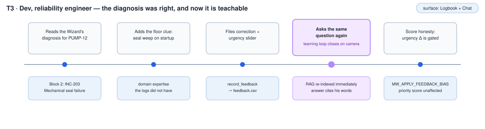

### The journey

1. **Dev reads the Wizard's diagnosis for PUMP-12** — *Wizard Chat*: "cooling
   pump status" returns Block 2 probable fault **INC-203 - Mechanical seal
   failure (2024-12-26)**.
2. **He adds what only the floor walk revealed** — the startup seal weep is the
   missing context that turns a correct diagnosis into reusable plant knowledge.
3. **He files the correction and urgency slider** — *Digital Logbook* calls
   `record_feedback`, storing: "actual cause was the mechanical seal, not the
   bearing" and note "seal weep recurred on startup".
4. **He asks the same question again** — RAG re-indexes immediately. The next
   answer can retrieve a `feedback` hit whose source is **Engineer feedback
   PUMP-12** and whose text includes his own words.

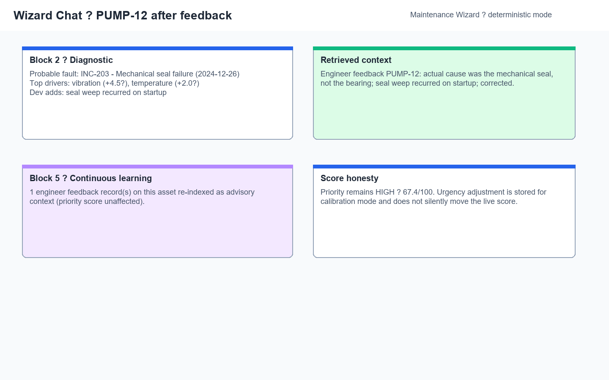

5. **The score stays honest** — Block 5 says: **1 engineer feedback record(s)
   on this asset re-indexed as advisory context (priority score unaffected).**
   The urgency delta is stored for calibration mode; it does not silently move
   the live priority score.

### What to notice (judges)

- **Step 4:** the learning loop closes on camera: feedback becomes retrievable
  context immediately.
- **Step 5:** two-channel honesty — retrieval learns now, scoring changes only
  when `MW_APPLY_FEEDBACK_BIAS` is explicitly enabled.
- **Tacit knowledge becomes citable:** a floor observation is promoted from
  memory to structured, asset-filtered evidence.

### Demo script (2:00)

| Clock | Action | Expect on screen |
|---|---|---|
| 0:00 | Chat: *cooling pump status* | Block 2: INC-203 - Mechanical seal failure (2024-12-26) |
| 0:30 | Logbook tab: pick PUMP-12, type the correction, set slider +10, submit | Feedback saved |
| 1:10 | Chat: same query again | Same risk score, now with learning line |
| 1:30 | Point at feedback citation + Block 5 | 1 engineer feedback record(s) re-indexed; priority score unaffected |
| 2:00 | End | — |

### Traceability

Demonstrates PDF objectives: 6.6 (feedback-driven improvement), 4.4 (multi-turn
NL), 6.4 (audit trail).

## T4 · Shalini, maintenance manager — "Where is tomorrow's downtime coming from?"

> *Standup is in five minutes and the only honest answer to "what's our biggest
> risk?" has to survive being clicked on.*

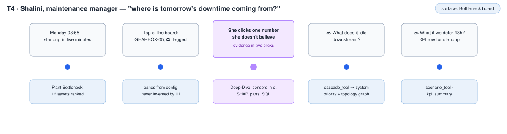

### The journey

1. **Shalini opens the Plant Bottleneck board** — *Bottleneck board*: the same
   deterministic scan ranks **12 assets** by priority score, with **1 critical**
   and **1 constraint-flagged**.
2. **The top card is already the conversation** — **GEARBOX-05** sits at the
   top with the ⛔ constraint chip. The band comes from `config.py` thresholds,
   not UI copy.

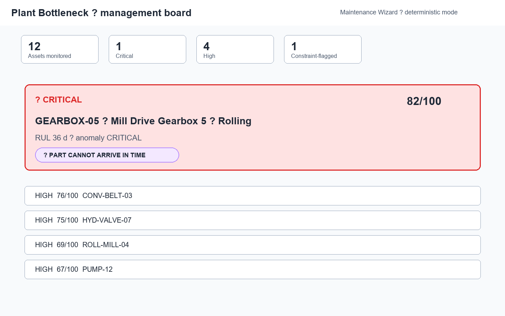

3. **She clicks one number she doesn't believe** — *Asset Deep-Dive*: the
   evidence room shows sensor deviations in σ, SHAP drivers, parts status, and
   the SQL used to summarize downtime.
4. **🔜 What does it idle downstream?** — `cascade_tool` adds system priority
   and topology impact, linking an asset risk to the line it can idle.
5. **🔜 What should we run this shift?** — `shift_plan_tool` allocates the
   flagged work to crews under crew-hour + spares constraints, deferring what
   doesn't fit and diverting parts-infeasible jobs to procurement: a next-shift
   plan, not a debate.

*🔜 = backend tools merged on `codex/plant-cascade` (`cascade_tool`,
`shift_plan_tool`; design in `docs/superpowers/plans/2026-06-13-next-shift-planner-mvp.md`).
The dashboard surfacing is pending the frontend rewrite on `codex/mw2-port`;
delete these tags when the UI lands. (`scenario_tool` + `kpi_summary` are a
separate deferred "explain & manage" tranche.)*

### What to notice (judges)

- **AI to build, UI to validate:** the management story is not a chat answer;
  it is a ranked board whose numbers survive interrogation.
- **Same deterministic brain:** the board ranking comes from the same
  `risk_score_tool` contract the eval judges exercise.
- **Planned, not vapor:** the in-flight steps point to a committed implementation plan
  for cascade, scenario, and KPI work.

### Demo script (1:30)

| Clock | Action | Expect on screen |
|---|---|---|
| 0:00 | Bottleneck tab, read the counts row | 12 assets · 1 critical · 1 constraint-flagged |
| 0:20 | Point at the GEARBOX-05 card + ⛔ chip | GEARBOX-05 is top-ranked |
| 0:40 | Deep-Dive: sensor σ-deviations, SHAP bars, parts table | Evidence room explains the score |
| 1:10 | Mention the cascade/KPI tranche in one sentence | Planned cascade/scenario/KPI plan in repo |
| 1:30 | End | — |

### Traceability

Demonstrates PDF objectives: 5.2 (risk bands, plant bottleneck), 6.4
(traceability), 7 (dashboard).

---

# Part 2 — To-be (ROADMAP)

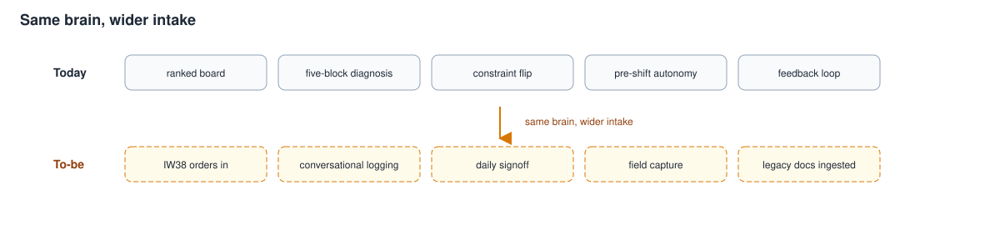

## F1 · Shalini — "One inbox for the plant"

> **ROADMAP — nothing in this journey is built yet.** It exists to drive
> planning; see the gap table.

> *Shalini runs the plant from three places that don't talk: IW38 in SAP, the
> HMI wall, and a Word file called breakdowns_final_v7.docx.*

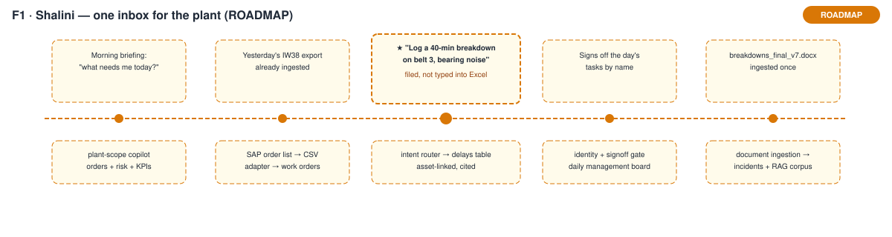

### The journey

1. **Shalini asks what needs her today** — *manager copilot*. A plant-scope
   briefing spans work orders, risk, and KPIs instead of one asset at a time.
2. **Yesterday's IW38 export is already in** — SAP order CSVs become a governed
   work-order table, not a manual paste into a deck.
3. **She logs a breakdown conversationally** — "log a 40-min breakdown on belt
   3, bearing noise" becomes a cited, asset-linked delay record.
4. **She signs off the day's tasks by name** — identity and a signoff gate move
   daily management from memory to an auditable board.
5. **The legacy Word file is no longer a dead end** —
   `breakdowns_final_v7.docx` is ingested once, then searchable as incident and
   RAG context.

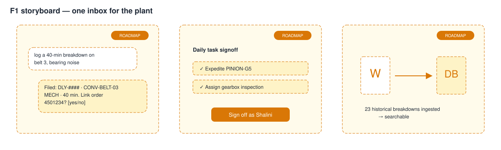

### What to notice (judges)

- **Same brain, wider intake:** Part 1 proves the reasoning loop; F1 widens the
  data contracts around it.
- **Writes stay gated:** conversational logging routes intent to a reviewable
  write path, not free-form mutation.
- **The future work has names:** every gap maps to an existing research section or a
  proposed `NEW-*` feature.

Demo: 30-second storyboard walkthrough of the frames below.

### Gap table

| Journey step | Missing today | Feature that closes it | Link | Effort |
|---|---|---|---|---|
| 1 Morning briefing | Plant-scope chat (today's pipeline is per-asset) | Governed manager copilot | FEATURE_RESEARCH §3.5 | M |
| 2 IW38 ingestion | SAP adapter + work-order data contract | **NEW-1** SAP IW38 CSV adapter | NEW | M |
| 3 Conversational logging | Intent router + gated write path beyond feedback | **NEW-3** Conversational intake intent router | NEW | M |
| 4 Daily signoff | User identity; task list; signoff gate | **NEW-4** Identity & signoff · **NEW-5** Daily management board | NEW | M–L |
| 5 Legacy docs | docx/xlsx parsers → incidents/corpus | **NEW-2** Legacy document ingestion | NEW | S–M |

### Traceability

Planning extension of PDF objectives: 4.3 (ERP/manuals/logs), 5.4 (decision
summaries), 6.4 (audit trail), 7 (dashboard).

## F2 · Arjun — "The wrench doesn't stop for paperwork"

> **ROADMAP — nothing in this journey is built yet.** It exists to drive
> planning; see the gap table.

> *A coupling lets go mid-shift. The fix takes forty minutes; today the
> paperwork takes longer.*

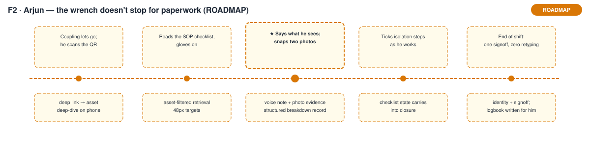

### The journey

1. **Arjun scans the asset QR** — *mobile-lite deep link*. The phone opens the
   relevant asset deep-dive instead of a desktop dashboard.
2. **He reads the SOP with gloves on** — asset-filtered retrieval becomes a
   48px-target checklist.
3. **He says what he sees and snaps two photos** — voice note plus photo
   evidence becomes a structured breakdown record.
4. **He ticks isolation steps as he works** — checklist state carries forward
   into closure, so proof is captured during the job.
5. **He signs off once at shift end** — named identity writes the logbook entry;
   there is no retyping into another system.

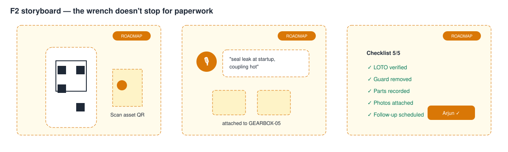

### What to notice (judges)

- **Field capture is not a second app:** it is the same traceable maintenance
  brain with a mobile intake surface.
- **Paperwork disappears into the workflow:** evidence is collected while work
  happens, not reconstructed later.
- **The gap is bounded:** this is the mobile-lite subset, not a full PWA rewrite.

Demo: 30-second storyboard walkthrough of the frames below.

### Gap table

| Journey step | Missing today | Feature that closes it | Link | Effort |
|---|---|---|---|---|
| 1 QR deep link | `?asset=` query param + printable QR codes | Mobile-lite subset | FEATURE_RESEARCH §3.9 | S |
| 2 Glove-first SOP view | Mobile layout per UIUX spec | Mobile-lite subset | FEATURE_RESEARCH §3.9 | S–M |
| 3 Voice + photo capture | Mic input; `st.camera_input` → logbook attachment | Mobile-lite subset | FEATURE_RESEARCH §3.9 | S |
| 4 Checklist carry | Persist ticked steps into closure | Mobile-lite subset / UIUX §4 | FEATURE_RESEARCH §3.9 | S |
| 5 Shift signoff | User identity; named closure | **NEW-4** Identity & signoff | NEW | M |

### Traceability

Planning extension of PDF objectives: 4.4 (natural-language intake), 5.3
(step-by-step actions), 5.4 (digital log), 6.4 (audit trail).

---

# Additions proposed for FEATURE_RESEARCH.md

The F-journeys surface five features the research doesn't yet contain:

1. **NEW-1 · SAP IW38 CSV adapter** — ingest maintenance + calibration order
   exports via the existing CSV-contract seam (ARCHITECTURE_DESIGN §5.2).
2. **NEW-2 · Legacy document ingestion** — Word/Excel breakdown logs →
   incidents table + RAG corpus, one-time migration per asset.
3. **NEW-3 · Conversational intake intent router** — classify a field message
   (breakdown / reading / order reference / closure) and write to the correct
   table through a gated, cited path.
4. **NEW-4 · User identity & signoff** — named closures and a signoff gate
   (today everything is signed "engineer").
5. **NEW-5 · Daily management board** — today's tasks, signoff state, exceptions.

# Deck hooks

Slide candidates, in pitch order (slide edits in `docs/deck/build_deck.js` are
a separate task):

1. **The flip** — `t1_map.svg` + `t1_fiveblock_constraint.png` (constraint-aware
   reasoning is the signature moment).
2. **Before anyone logs in** — T2's cold open + `t2_wallboard.png` (Systems of
   Action).
3. **Same brain, wider intake** — `today_vs_tobe.svg` (the vision slide).
4. **The cast** — `cast.svg` (who it's for).
